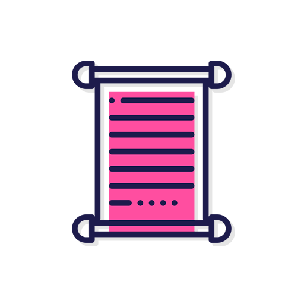

# Rollup

🌟 A simple Discord bot for cleaning channels via threading. 📜

---

---

## Invite Link

→ [Add me](https://discord.com/api/oauth2/authorize?client_id=912600348617760798&permissions=397821733952&scope=bot%20applications.commands) to your server!

## Features

- One super simple slash command: `/rollup <messages> <thread>` 📜
  - **`messages`**: How many messages should be forwarded to a thread; counts backwards from the most recent in the current channel
  - **`thread`**: The name of the thread created
- Everyone who sent a message that was forwarded will automatically be added to the new thread! 🧵
- All messages are forwarded using a single webhook, keeping things neat ✨
- Retain message formatting, and even see who sent it! ✅
- Message order is preserved 💬

## Usage/Examples

Use Rollup:

- As an alternative to purging messages — maybe you want to keep the history of a conversation, it's just no longer relevant to keep in your main channel
- To get rid of a spammy interaction between two people in a larger conversation channel — Rollup will automatically move both users to the thread, so they can keep talking uninterrupted there

## Roadmap

Future features planned:

- Simple yes/no option on adding people automatically to the new thread (default `yes`)
- Simple yes/no purge option to skip creating a thread (default `no`)
- Option of creating a public or private thread (default `public`)
- Additional archiving and locking features, based on user's permissions in the server

## Demo

*Coming soon!*

## FAQ

#### So how about privacy — how does Rollup handle data?

Rollup actually stores *nothing*! It fetches per-server data quickly through only the commands you give it, and everything is sent through one webhook, which you can check out in the `Integrations` panel of your server.

#### What're all these permissions Rollup is requesting access to?

Here's a breakdown of what Rollup requests access to and why:

> **The self-explanatory stuff:**

- View Channels
- Read Message History
- Send Messages
- Send Messages in Threads
- Create Public Threads
- Create Private Threads
- Embed Links
- Attach Files
- Use Application Commands

> **These features aren't yet utilized, but may be in a future update, so to avoid asking you to reauth the bot with every update, they are granted from the start:**

- Add Reactions
- Use External Emoji
- Manage Threads: for future archiving/locking features; see Roadmap above

> **More sensitive access, and why Rollup needs it:**

- Manage Messages: for deleting the messages originally sent
- Manage Webhooks: to avoid clutter, Rollup checks to make sure there's only one webhook in your server, rather than per-channel. And since you'd probably like to use Rollup in more than just one channel, the webhook's linked channel will need to be edited with each new thread created.

## Support

> ~~For help with the rollup command, use `/rollup help`.~~
>
> Help command coming soon!

The bot is still very new, and I'm working to resolve bugs I find in the servers I'm in. For any issues you encounter, feel free to [submit an issue](https://github.com/edwardshturman/rollup-bot/issues).

## Tech Stack

- **Node.js** + **Discord.js**: core libraries for interacting with Discord
- **Heroku**: deployment

## Contributions

This is primarily a personal project for me and my friends, which I decided to share here publicly. For the time being, I don't have an open-source license set for Rollup, and as such, must politely decline contributions.

Feel free to look around, but please refrain from copying, modifying, or distributing Rollup source code without my explicit permission. Thank you!

# 🚀 About Me

👋 Hi there! I'm Edward, and I'm a Computer Science Major at the University of San Francisco. 💻

Rollup is a Discord bot I made for my group of friends and our Discord server. In our trip planning channel (where we use [Register](https://edwardshturman.com/register) — another one of my bots 😉), we'd more and more frequently see that with an increasing amount of events being planned, comes an increasing amount of spam, both related to the event, and just regular chit-chat in between.

Well, here's my fix! I'll be updating it regularly for now. Hope you enjoy!

## 🔗 See more of my work and say hello

